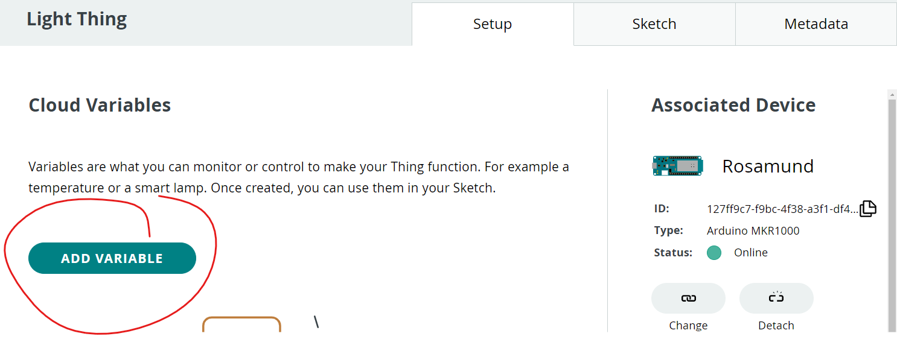
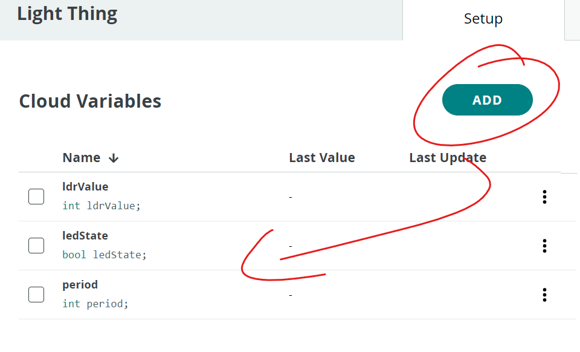
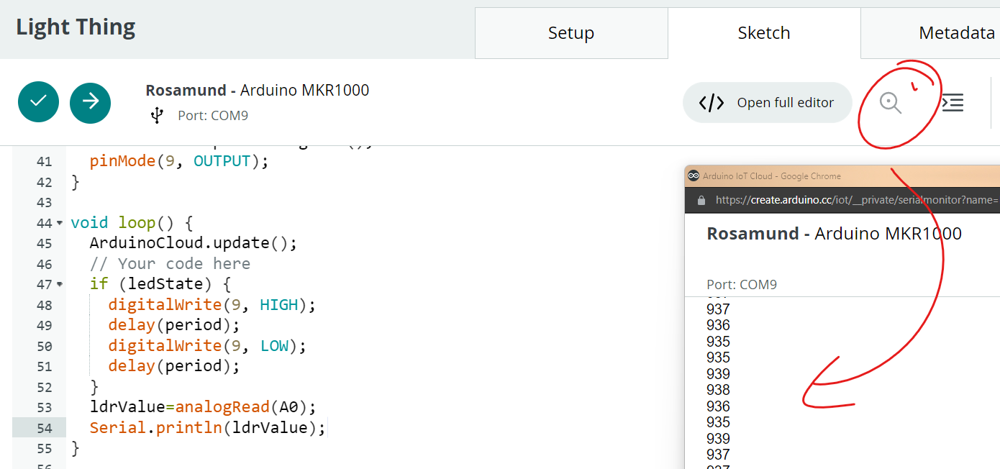
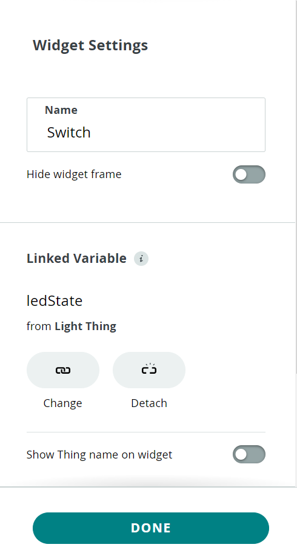

# Variables

We would like to control the LED from a dashboard in IoT cloud. 

+ In the Light Thing, click the "ADD VARIABLE" button.

+ Add the following Variables:

+ Replace the contents of the loop() funtion with the folowing:

  ~~~c++
    ArduinoCloud.update();
    // Your code here
    if (ledState) {
      digitalWrite(9, HIGH);
      delay(period);
      digitalWrite(9, LOW);
      delay(period);
    }
    ldrValue=analogRead(A0);
    Serial.println(ldrValue);
  ~~~

+ Upload the program and have a look at the Serial output by clicking on the Serial Monitor button. You should be able to see LDR Values change as you cover the LDR with your hand:

  

## Dashboard

+ Select the Dashboards tab and add click on "**Create**"
+ Name the Dashboard "Light Dash" and click on the ADD button.
+ Select the "Switch" widget and link it to the ledState variable. Click on Done

+ Click the Add button again, select the Slider widget. Link it to the **"period**" variable and c**hange the range of values to 0 to 1000**. Click on Done when finished.

+ Following the same process, add a "Chart" widget and link it to the ldrValue variable.
+ Now view your Dashboard. You should see live data from the light sensor(LDR) on the chart. You can also control the frequency of the LED blink with the slider and turn it off/on with the switch.  