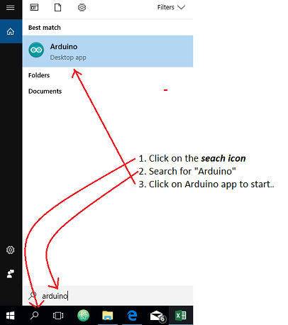
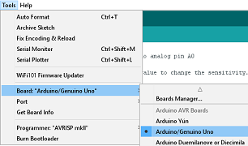
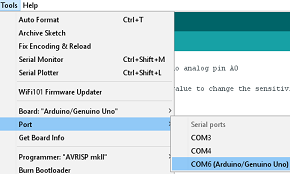

# Setup

## Hook up your Arduino

Take out your arduino board and USB cable and connect the arduino to your workstation as shown in the below diagram: 


## The Arduino App

### Opening the Arduino App

In the bottom left corner of the screen, click on the search icon to open the search window. Type "Arduino" and you should see the Arduino app in the search results. Click on the Arduino app to start it.
> 

All going well, you should see something similar to the following: 
>

###Connecting the board
You will use the Arduino App to write programs that will run on the Arduino Board. To connect your board to the app:

- In the Arduino App, select *Tools->Board* and select "Arduino/Genuino Uno"


- Select *Tools->Port* and select the port that says "Arduino/Genuino Uno". 


##Build Circuit

We wire up the experiment as shown in figure 2.
>

##Write the code

Create a new sketch in Arduino IDE:

Enter the following code and upload it to the board:

```
// the setup function runs once when you press reset or power the board
void setup() {
  // initialize digital pin 13 as an output.
  pinMode(13, OUTPUT);
}

// the loop function runs over and over again forever
void loop() {
  digitalWrite(13, HIGH);   // turn the LED on (HIGH is the voltage level)
  delay(1000);              // wait for a second
  digitalWrite(13, LOW);    // turn the LED off by making the voltage LOW
  delay(1000);              // wait for a second
}
```

##Upload the code
Click on the *Upload* button in the top left corner of the Arduino IDE. After a short time, you should see your LED start to blink. 
>

Congratulations! You've created your first Arduino program.

##Challenge (If you have the time...)

Try the following challenges:

- Change the program to make the LED blink faster (e.g. every 0.5 seconds).
- Make two LEDs blink simulaniously (hint: get another LED and connect the anode in series with a 220-ohm resistor to pin 12. Connect cathodes connect to ground. Then update the program to blink the LED.
