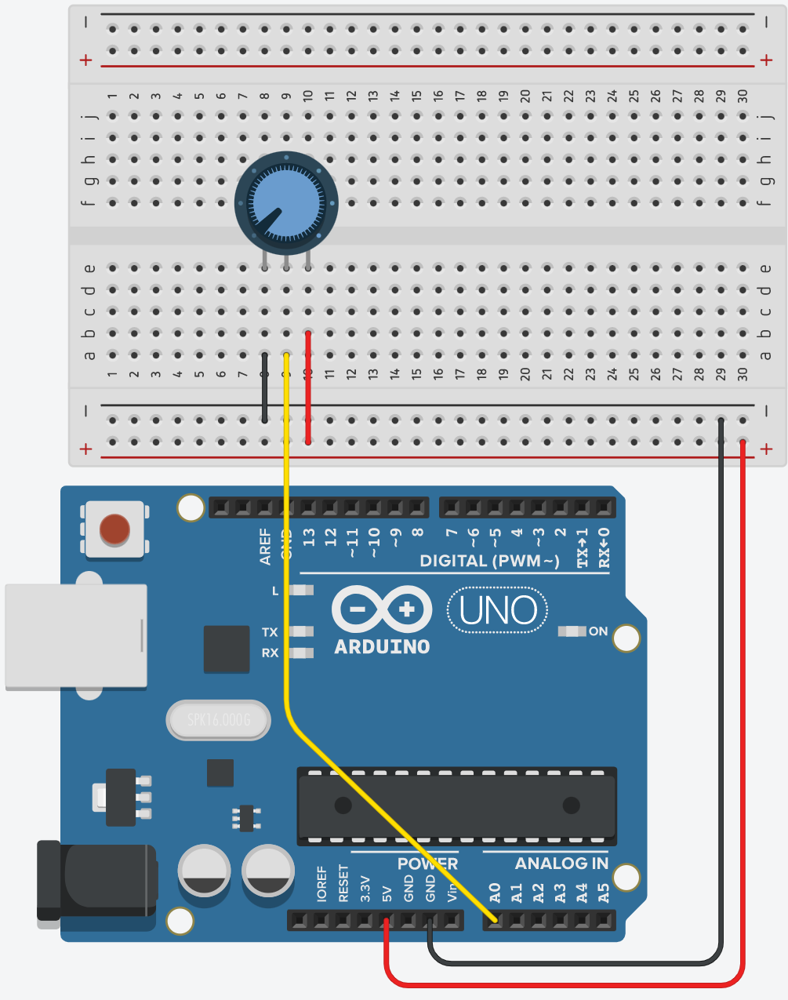

# Analogue to Digital 

In this step, you will use the Arduino Analogue to Digital capabilities. The analogue input will be a voltage from a Potentiometer(0V-5V). 
Arduino boards contain a multichannel, 10-bit analogue to digital converter. This means that it will map input voltages between 0 and 5V into integer values between 0 and 1023. 

.

+ Add the following variables to the top of the program:

~~~c
int sensorValue = 0;
int outputValue = 0;
~~~

+ Replace the entire contents of the Loop() function with the following:

~~~c
   // read the analog in value:
  sensorValue = analogRead(A0);
  // map it to the range of the 7 pin display (0 to 9):
  outputValue = map(sensorValue, 0, 1023, 0, 9);
  // print to serial just for the craic
  Serial.println(outputValue);
  
  delay(20);

~~~

+ Run it. You should now be able to see and adjust the value that is ouput to the console. 