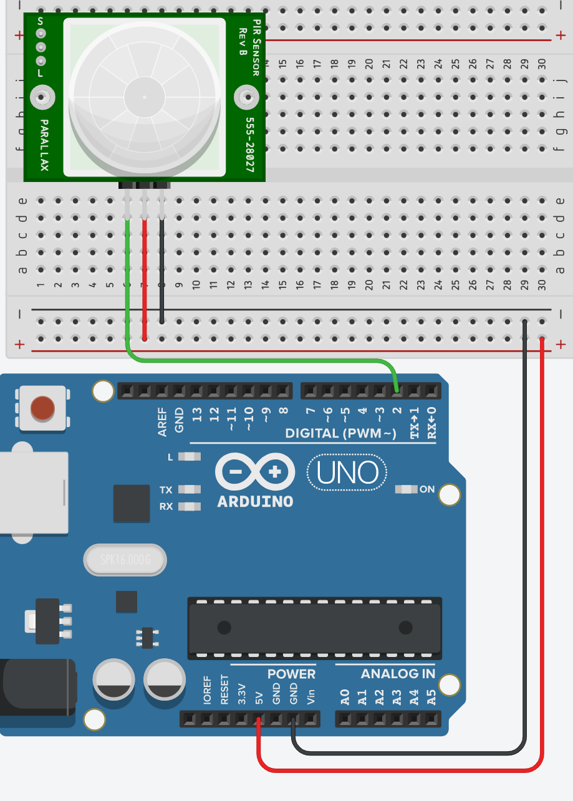

# Motion Detection

You will now use a PIR sensor to sound an alarm when motion is detected.

Click on the following link and build the following Tinkercad circuit. Test that it works:

https://www.tinkercad.com/things/eM5SitFY7jO-fabulous-densor-fulffy/editel?tenant=circuits

Now update the circuit and program to provide a signal when motion is detected. 

Use a Piezo Buzzer or a LED (or both) to indicate movement. You can reference the following programmes to do this. You could also ask ChatGPT too!

https://www.tinkercad.com/things/ipAVHOGzHqH-shiny-juttuli/editel?tenant=circuits

