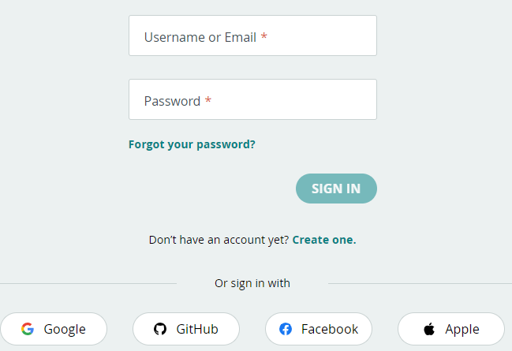

# Arduino Cloud Account

To starting using the Arduino IoT cloud, use the following link to  [log in or sign up to Arduino](https://create.arduino.cc/iot/things). You can use your Google, Github, Facebook or Apple ID if you wish

+ When you have signed in, go to the **Arduino IoT Cloud** by clicking on the four dots menu in the top right corner. You can also [go directly to the Arduino IoT Cloud](https://create.arduino.cc/iot/).

### Add a Device

+ Select the **“Devices"** tab at the top of the Arduino IoT Cloud interface to manage and add new devices.  You will need to have the [Arduino Agent installed](https://create.arduino.cc/getting-started/plugin/welcome). You will be prompted to do this.
+ Click the "ADD" button and follow the instructions to add your Arduino board.
  

### Create a Thing

+ Select the **"Things"** tab and click the "**CREATE"** button to set up a new thing.

+ In the Setup tab, Name your thing "Light Thing" and associate it with the device you just added in the last step.

+ In the Network part, enter the SSID and password of the wifi. It will be given to you in class. 

  

## Programming the Device - Blink Again!

Select the "Sketch" Tab. It will have some auto generated code in it based on your configuration so far. Notice it has the same structure as the code used in previous labs, with a setup() and loop() function.

+ Add the following statement at the end of the setup() function to configure digital pin 9 for output 

  ~~~c++
  pinMode(9, OUTPUT);
  ~~~

+ Add the following code to the loop() function just under the ""//your code here" comment. If it's wired correctly, you should see it blink every second. 

+ ~~~c++
    digitalWrite(9, HIGH);
    delay(1000);
    digitalWrite(9,LOW);
    delay(1000);
  ~~~

+ Upload the code to the device. If it's wired correctly, you should see it blink every second. 