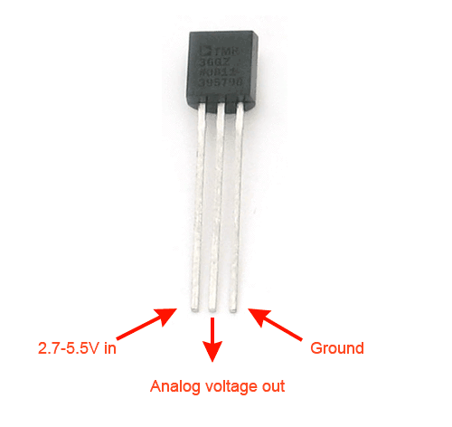
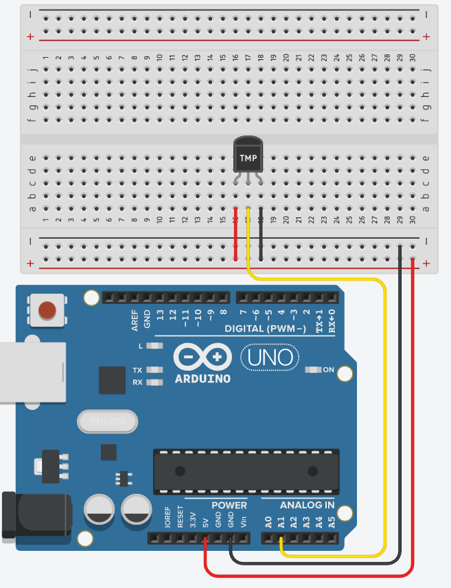
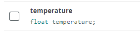
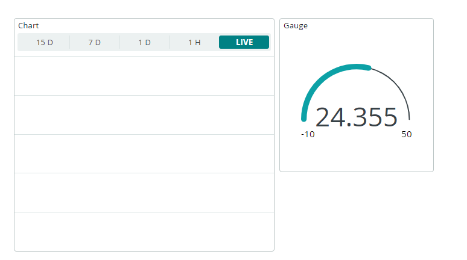

# Plant Minder

Monitor Temperature and Soil Moisture of your plants using Arduino and the Arduino IoT Cloud. 

### Initial Setup

Log in to the Arduino IoT Cloud and Create a new Thing called Plant Monitor.  See the previous labs for how to do this. 

https://reader.tutors.dev/lab/project-2-2023/topic04/book-01/Create%20Account

### Temperature Sensor

Your IoT bundle comes with a TMP36 sensor. 

Using the TMP36 is easy, simply connect the left pin to power (2.7-5.5V) and the right pin to ground. Then the middle pin will have an analog voltage that is directly proportional (linear) to the temperature. The analog voltage is independent of the power supply. We can use the following formula to convert the Analog reading to degrees Celcius:

**temperature =  ( 4.4 * sensor_data * 26) / 1024.0;**

+ Build the following circuit as shown below: 

### Temperature Variable

You will need to add a temperature variable to the Thing. 

+ In the Plant Monitor Thing, go to Set Up and add the following Variable: 

  

### Sketch

+ The temperature sensor is connected to Analog pin A1. Add the following at the top of the Sketch  

  ~~~c++
  #define temp_sensor_pin A1
  ~~~

+ In the loop() function, add the following where indicated(i.e. just under the ``ArduinoCloud.update();`` statement)

~~~c++

  int sensor_data = analogRead(temp_sensor_pin);
  temperature =  ( 4.4 * sensor_data * 26) / 1024.0;

  Serial.print("Current Temperature: ");
  Serial.println(temperature);

  delay(2000);
~~~

Upload the program to the Arduino and make sure it compiles. Check the Serial monitor to ensure the temperature is output correctly. 

### Dashboard

You will now create a control panel using the Arduino IoT Dashboards. Navigate to **Dashboards -> Build Dashboard -> ADD,** then we can widgest and link them to the temperature variable as the following:

- Graph widget -> temperature variable
- Graph widget -> temperature variable

You should now see a visual representation of our sensor data.

### Exercise/Challenge

We don't need the temperature to 3 decimal places(and it doesn't look good). Change the code to round temperature to just one decimal place (hint: Google *"round  arduino one decimal place"* and see if you can f )

