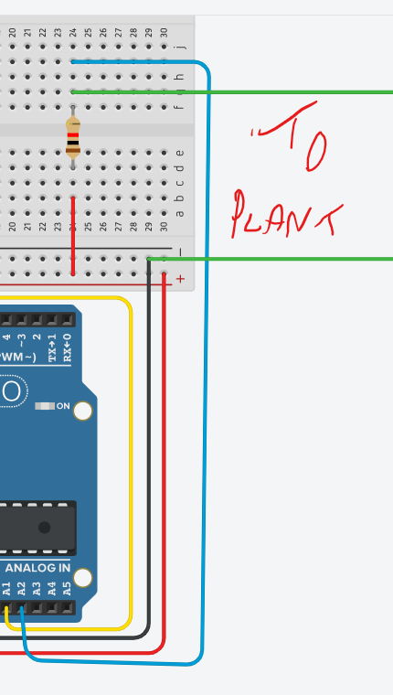
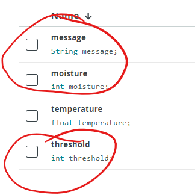
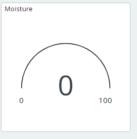
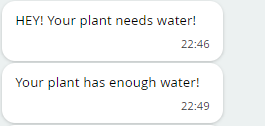

# DIY Moisture Sensor

Increasing the moisture of soil also increases the conductivity (and consequently reduces the resistance) of electricity. We can take advantage of this property to create a basic soil moisture sensor. 
Two wires placed in the soil pot act as a variable resistor, whose resistance varies depending on soil moisture. This is connected in a voltage divider configuration, and an analog input pin on the Arduino collects a voltage proportional to resistance between the 2 wires. The more wet the soil is, the less voltage will be measured from the Arduino because the resistance in the soil decreases with its moisture. The dryer the soil is the higher resistance is. Using the **1 Mega Ohm resistor** and two wires, we can create our DIY soil moisture sensor.

+ Add the following circuit to your current Arduino set up. 

We will need a few variables(**moisture,  threshold** and **message**), in our program to display and control the logic.

+ In Arduino IoT Cloud, add the following 3 variables to the Plant thing set up: 

That value will be used to set  threshold will be used to decide when your plants need water. The value from the moisture sensor will be assignmed to Moisture. The Message variable will be used to communicate instructions to the user.

### The Code

+ The moisture sensor is connected to pin A2. Add the following definition at the top of the program. 

~~~c++
#define moisture_sensor_pin A2
~~~

+ Add the following function to calculate the moisture value. Insert it at the bottom of the program. 

~~~c++
int get_average_moisture() {  
 int tempValue = 0; /* variable to temporarily store moisture value */  
 /* make an average of 10 values to be more accurate */  
 for (int a = 0; a < 10; a++) {  
 tempValue += analogRead(moisture_sensor_pin);  
 delay(100);  
 }  
 return tempValue / 10;  
}  
~~~

+ Add the following code to the loop() function , just above the ``delay(2000);`` statement

~~~c++
moisture = get_average_moisture();
  Serial.print("moisture: ");
  Serial.println(moisture);
  if (moisture > threshold) {
    message = "HEY! Your plant needs water!"; 
  } else {
    message = "Your plant has enough water!";
  }
  Serial.println(message);
~~~

Run the program and check the serial output. The value should be 1024 then the wires are not in soil. 

+ Insert the wires into wet soil and observe  the moisture value. Select a suitable threshold that will differentiate between wet and dry

### Dashboard

We need to add more widgets to the control panel using the Arduino IoT Dashboards. Navigate to **Dashboards -> Build Dashboard -> ADD,** then we can add three widget and link them to the variable as the following:

- Gauge widget -> moisture variable , range 0-1023
- Messenger widget -> message variable
- Slider widget -> threshold variable, range 0-1023

Go to the Plant dashboard and add a Gauge widget with the following settings. 

+ Use the dashboard to set the threshold and observe the messages coming in from the device

  

  Congratulations! you have now build your own DIY plant monitor.