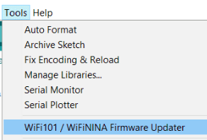
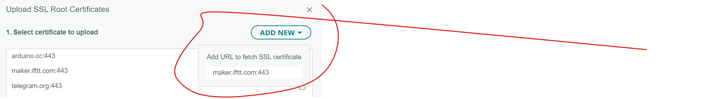

# OPTIONAL: Automatic Email via IFTTT

n this step you will use a React app  to trigger an HTTP request to IFTTT in ThingHTTP. You will create specific email of channel activity from ThingSpeak data. 

IFTTT(If this then that) lets you create *applets*(think of them as small apps) that act in response to another action. You can use the IFTTT *Webhooks* service to create web requests to trigger an action. The incoming action is an HTTP request to the web server, and the outgoing action is an email to your account. 

## If This...

+ Create an [IFTTT](https://ifttt.com/) account if you do not already have one (you can use your Google ID if you have one).  
+ Log in to your account. Go to your home page and click **Create** and then click "Add" 
  
+ Select the Webhooks service. Enter Webhooks in the search field. Select the Webhooks card. After you select Webhooks as the trigger, click the "Receive a web request" card to continue.  
  
+ Enter the event name "TooHot". Click Create Trigger.  
  

## Then That...

+  To Select the resulting action, click on "Add"" in the Then That card. 
     
+  Enter "Email" in the search bar, and click the Notifications box. Then select "Send me an email" card and enter your email address.  
     
+  Follow the instructions to set up and connect your email address.
   
+  Update the subject and body of the event email as shown, or add whatever text you want...
   
+  Finally, click Create Action followed by Continue. You should now have a connected IFTTT Service. 

## Get the trigger URL

+ To retrieve the URL for the Service(or "webhook"), click on your user icon in the top right corner and select  "My Services"   
  
+ Scroll down and select "webhooks" and then click on the "Documentation" icon"
  
+ You'll see your key and the format of the URL you need to request. Enter the event name("DryPlant"). 

You can test the service by copying and pasting the URL into the browser. 

### Fire the event from Arduino

You now need to fire this event from the Arduino. We want this event to fire only when the message variable changes to "Please Water Plant."
However, we only want to send an email when the status changes from wet->dry, otherwise you will get loads of emails!
Create a new string called lastMassage at the top of the program and assign it "HEY! Your plant needs water!"

~~~
String lastMessage = "HEY! Your plant needs water!";
~~~

In the main loop, find  the if statement to check for a state change (wet->dry) and print it using serial

~~~c++
if (moisture > threshold) {
    message = "HEY! Your plant needs water!";
    //check if state change(ie moving from wet to dry)
    if (lastMessage!=message){
      Serial.printlm("Send Email Now");
    }
    lastMessage=message;
  } else {
    message = "Your plant has enough water!";
    //set last massage variable
     lastMessage=message;
  
  }
~~~

### Send message to IFTTT

We now need to send a request to IFTTT to trigger the web hook and send the email when the plant is dry. 

### SSL Certificate

+ IFTTT requires an SSL Certificate installed on your device. This is to allow encrypted communication between your device and IFTTT. 
+ Connect your MKR1000 to your machine/Laptop. Open the Arduino IDE on your desktop and from the menu and select tools->Wifi Firmware Updater
  

Follow the instructions and upload the Firmware Updater to your MKR1000

+ In the Arduino IDE, select Tools->Upload SSL Root Certificates. 
+ In the dialog, select **Add New** and enter ***maker.ifttt.com:443*** . This is the domain and port to access IFTTT services. 
  

+ Open your program in the IDE and include the BearSSL library in your project:

  

  

### Arduino program

Add the following declarations at the top of your program to create a web client:

~~~c++

WiFiClient client;
~~~

Add the following iftttSend() function at the end of your script:

~~~c++
void iftttSend() {
  char server[] = "maker.ifttt.com";
  Serial.println("Alarm triggered !");
  // Connexion au serveur IFTTT
  Serial.println("Starting connection to server...");
  if (client.connectSSL(server,443)) {
    Serial.println("Connected to server IFTTT, ready to trigger alarm...");
    // Make a HTTP request:
    client.println("GET /trigger/DryPlant/json/with/key/XXX HTTP/1.1"); // Replace "XXX" by your own IFTTT key
    client.println("Host: maker.ifttt.com");
    client.println();
    Serial.println("IFTTT alarm triggered !");
  }
  else {
    Serial.println("Connection at IFTTT failed");
  }
}
~~~

Finally, call the iftttSend() function when the plant goes from Wet to Dry.

~~~c++
if (moisture > threshold) {
    message = "HEY! Your plant needs water!";
    //check if state change(ie moving from wet to dry)
    if (lastMessage!=message){
      Serial.println("Send Email Now");
      iftttSend(); // ****ADD THIS LINE****
    }
    lastMessage=message;
  } else {
    message = "Your plant has enough water!";
    //set last massage variable
     lastMessage=message;
  
  }
~~~

