# OPTIONAL: Automatic Email via IFTTT

n this step you will use a React app  to trigger an HTTP request to IFTTT in ThingHTTP. You will create specific email of channel activity from ThingSpeak data. 

IFTTT(If this then that) lets you create *applets*(think of them as small apps) that act in response to another action. You can use the IFTTT *Webhooks* service to create web requests to trigger an action. The incoming action is an HTTP request to the web server, and the outgoing action is an email to your account. 

## If This...

+ Create an [IFTTT](https://ifttt.com/) account if you do not already have one (you can use your Google ID if you have one).  
+ Log in to your account. Go to your home page and click **Create** and then click "Add" 
  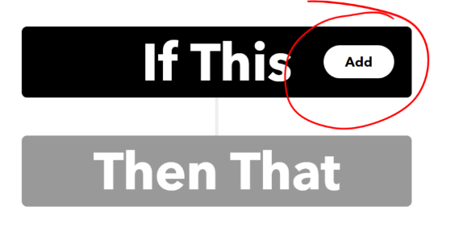
+ Select the Webhooks service. Enter Webhooks in the search field. Select the Webhooks card. After you select Webhooks as the trigger, click the "Receive a web request" card to continue.  
  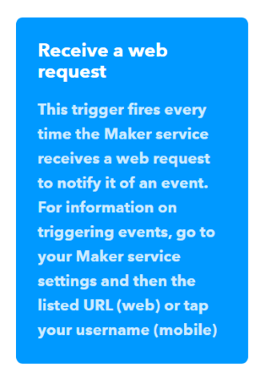
+ Enter the event name "TooHot". Click Create Trigger.  
  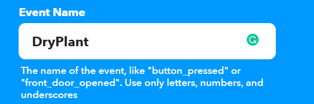

## Then That...

+  To Select the resulting action, click on "Add"" in the Then That card. 
   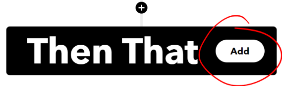  
+  Enter "Email" in the search bar, and click the Notifications box. Then select "Send me an email" card and enter your email address.  
   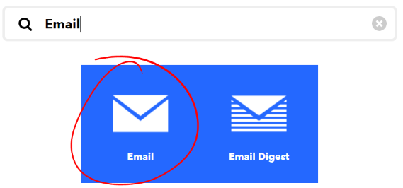  
+  Follow the instructions to set up and connect your email address.
   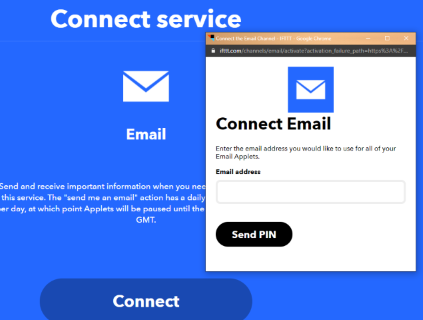
+  Update the subject and body of the event email as shown, or add whatever text you want...
   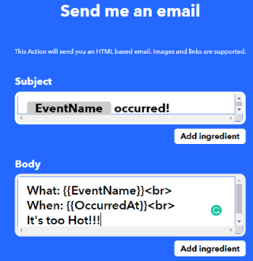
+  Finally, click Create Action followed by Continue. You should now have a connected IFTTT Service. 

## Get the trigger URL

+ To retrieve the URL for the Service(or "webhook"), click on your user icon in the top right corner and select  "My Services"   
  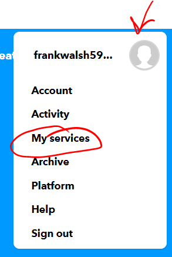
+ Scroll down and select "webhooks" and then click on the "Documentation" icon"
  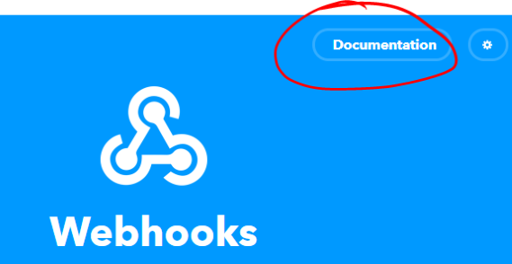
+ You'll see your key and the format of the URL you need to request. Enter the event name("DryPlant"). 

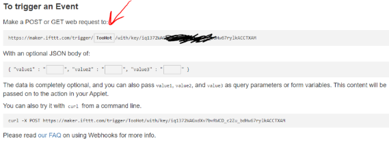

You can test the service by copying and pasting the URL into the browser. 

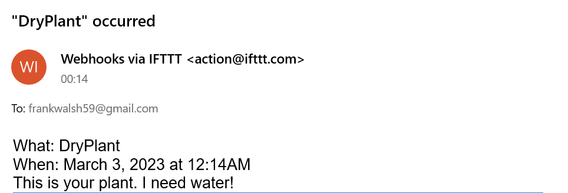

### Fire the event from Arduino

You now need to fire this event from the Arduino. We want this event to fire only when the message variable changes to "Please Water Plant."
However, we only want to send an email when the status changes from wet->dry, otherwise you will get loads of emails!
Create a new string called lastMassage at the top of the program and assign it "HEY! Your plant needs water!"

~~~
~~~

In the Arduino Editor, open the Library Manager and get wifi101 