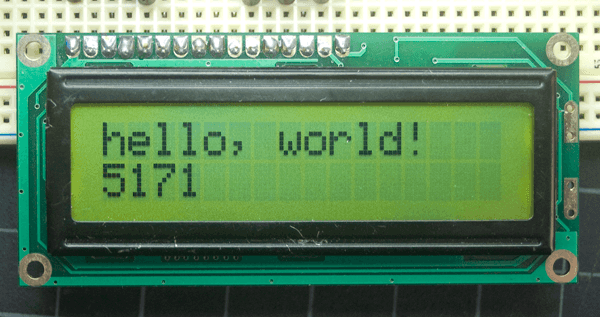
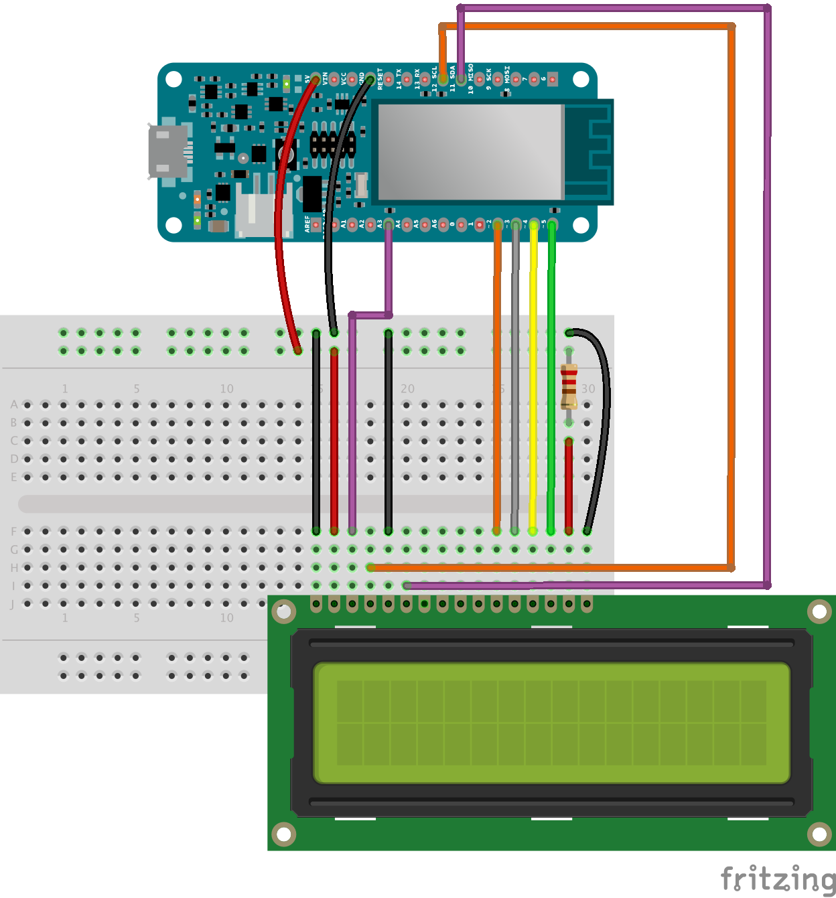

# LCD Display

In this lab you will learn how to connect and control a LCD Display.

### Introduction

The [LiquidCrystal library](https://www.arduino.cc/reference/en/libraries/liquidcrystal/) allows you to control compatible LCD displays. There are many of them out there, and you can usually tell them by the 16-pin interface.

The LCDs have a parallel interface, meaning that the microcontroller has to manipulate several interface pins at once to control the display. The interface consists of the following pins:

- A **register select (RS) pin** that controls where in the LCD's memory you're writing data to. You can select either the data register, which holds what goes on the screen, or an instruction register, which is where the LCD's controller looks for instructions on what to do next.
- A **Read/Write (R/W) pin** that selects reading mode or writing mode
- An **Enable pin(E)** that enables writing to the registers
- 8 **data pins (DB0 -DB7)**. The states of these pins (high or low) are the bits that you're writing to a register when you write, or the values you're reading when you read.

There's also a **display contrast pin (VEE)**, **power supply pins (VSS and VCC)** and **LED Backlight (LED+ and LED-)** pins that you can use to power the LCD, control the display contrast, and turn on and off the LED backlight, respectively.

The process of controlling the display involves putting the data that form the image of what you want to display into the data registers, then putting instructions in the instruction register. The [LiquidCrystal Library](https://www.arduino.cc/reference/en/libraries/liquidcrystal/) simplifies this for you so you don't need to know the low-level instructions.

### Components Required

+ Arduino Board
+ 22 Ohm Resistor
+ Compatible LCD Screen
+ Jumper Wires
+ Small Bread Board

### Circuit

This is a bit tedious. Wire up the following Circuit using the description and image below:

- LCD RS pin to digital pin 12
- LCD Enable pin to digital pin 11
- LCD D4 pin to digital pin 5
- LCD D5 pin to digital pin 4
- LCD D6 pin to digital pin 3
- LCD D7 pin to digital pin 2
- LCD R/W pin to GND
- LCD VSS pin to GND
- LCD VCC pin to 5V
- LCD LED+ to 5V through a 220 ohm resistor
- LCD LED- to GND

Note that we are using the 5V power supply and a 220 Ohm resistor. 

Upload the following program to the Arduino:

~~~c++
#include <LiquidCrystal.h>
int Contrast = 50;

const int rs = 12, en = 11, d4 = 2, d5 = 3, d6 = 4, d7 = 5;
LiquidCrystal lcd(rs, en, d4, d5, d6, d7);

int seconds = 0;

void setup() {
  analogWrite(A3, Contrast);
  lcd.begin(16, 2);
}

void loop() {
  lcd.setCursor(0, 0);
  lcd.print("Hi Applied Comp!");
  lcd.setCursor(0, 1);
  lcd.print(seconds);
  seconds += 1;
  delay(1000);
}
~~~

The brightness can be regulated changing the output value of the Analog pin 3 (the Contrast variable from 0 to 255) with 0 being the maximum value. 

You should see the message on the LCD display with the number of seconds since it started running.

### Cursor & Scrolling

You can use the  use the ``blink()`` and ``noBlink()`` methods to blink a block-style cursor.

+ add the following to the ``setup()`` function

  ~~~c++
  lcd.blink()
  ~~~

+ Replace the contents of the loop() function with the following:

  ~~~c++
  lcd.setCursor(0, 0);
    lcd.print("Hi Applied Comp!");
    lcd.setCursor(0, 1);
    for (int positionCounter = 20; positionCounter > 0; positionCounter--) {
         lcd.print(positionCounter);
         lcd.print(",");
         delay(2000);
    }
  lcd.clear();
  ~~~

  Notice how the numbers run off the right if the screen. 

+ Add the following to the Setup() function to allow scrolling:

  ~~~c++
  lcd.autoscroll()
  ~~~

  autoscroll() moves all the text one space to the left each time a character is added.

### Emojis (old style)

In this example we will display some custom characters on the LCD display

+ add the following to the top of the program:

~~~c++
// make some custom characters:
byte heart[8] = {
  0b00000,
  0b01010,
  0b11111,
  0b11111,
  0b11111,
  0b01110,
  0b00100,
  0b00000
};

byte smiley[8] = {
  0b00000,
  0b00000,
  0b01010,
  0b00000,
  0b00000,
  0b10001,
  0b01110,
  0b00000
};

byte frownie[8] = {
  0b00000,
  0b00000,
  0b01010,
  0b00000,
  0b00000,
  0b00000,
  0b01110,
  0b10001
};

byte armsDown[8] = {
  0b00100,
  0b01010,
  0b00100,
  0b00100,
  0b01110,
  0b10101,
  0b00100,
  0b01010
};

byte armsUp[8] = {
  0b00100,
  0b01010,
  0b00100,
  0b10101,
  0b01110,
  0b00100,
  0b00100,
  0b01010
};
~~~

Have a close look at the above arrays. Each position on the display is a 5 x 8 pixels. You can see that the '1's are where a dark pixel is, and '0' where a "white" pixel is:

+ Replace the setup() function with this code:

  ~~~c++
    analogWrite(A3, Contrast);
    lcd.begin(16, 2);
      // create a new character
    lcd.createChar(0, heart);
    // create a new character
    lcd.createChar(1, smiley);
    // create a new character
    lcd.createChar(2, frownie);
    // create a new character
      lcd.createChar(3, armsDown);
    // create a new character
    lcd.createChar(4, armsUp);
  
    // set the cursor to the top left
    lcd.setCursor(0, 0);
    // Print a message to the lcd.
    lcd.print("I ");
    lcd.write((byte)0); // when calling lcd.write() '0' must be cast as a byte
    lcd.print(" Arduino! ");
    lcd.write(1);
  
  ~~~

+ Replace loop() with the following:

  ~~~c++
    lcd.setCursor(4, 1);
    // draw the little man, arms down:
    lcd.write(3);
    delay(1000);
    lcd.setCursor(4, 1);
    // draw him arms up:
    lcd.write(4);
    delay(1000);
  ~~~

  

Run it. You should see a nice message with a little animated person!

