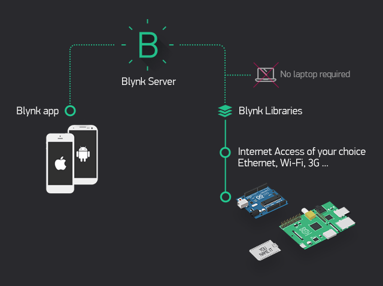

# IoT Mobile Apps using Blynk

Remote Hardware Control via Mobile App.

Blynk was designed for the Internet of Things. It can control hardware remotely, it can display sensor data, it can store and visualise data. 

In this lab you will:

+ Use the Blynk app to control a Raspberry Pi
+ Access your Phone sensors (light)
+ Send data to 3rd party service (Thingspeak)

## Equipment

+ Raspberry Pi 3/4 with SenseHAT
+ Mobile Phone (Android/iPhone)
