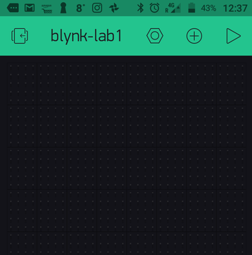
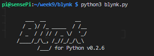

# Install/Set Up Blynk

You will need the Blynk app on an Android or IoS device such as a Smart Phone or Tablet. If you don't have a device available to do this, you can [emulate Android on your desktop](https://community.blynk.cc/t/blynk-desktop-app-android-emulator/13968).

+ Install the Blynk App for your Smartphone (or Tablet) from [here](https://www.blynk.cc/getting-started/). You should also be able to access it on the relevant app store for your device

Once installed, use the app to do the following:

+ Create a new account in Blynk App.
+ Create a New Project with the following details:  
 **Name:** Blynk-lab1  
  **Board:**  ``Raspberry Pi 3``  (choose this if you're using a RPi4 )  
  **Network connection:**  (Wifi or Ethernet).  

After the project is created, You will see your empty app. We will add controls to it later. **In the mean time, retrieve your project Auth Token in your email (check your junk folder if you can't find it)**.



# Install Blynk Library on the Raspberry Pi 3 B+

We will use ``Python`` Blynk library to control the RPi.


## Create your Blynk App


+ SSH into your Raspberry Pi and make a new folder for your Blynk project, *~/week9/blynk*.


+ At the command line, run the following to install the Blynk dependencies for Python 3

```bash
sudo pip3 install blynklib
```

+ In the ``~/week9/blynk`` folder, create a new file called ``blynk.py`` with the following content, replacing the value assigned to BLYNK_AUTH with your auth key:

```python
import blynklib

BLYNK_AUTH = 'TOKQooLxvbdfxxxxxohAhV5TJ1tktDJQw'

# initialize Blynk
blynk = blynklib.Blynk(BLYNK_AUTH)

# register handler for virtual pin V1 write event
@blynk.handle_event('write V1')
def write_virtual_pin_handler(pin, value):
    print('V1:'+ str(value))

# infinite loop that waits for event
while True:
    blynk.run()
```
+ Replace ``YOUR-AUTH-TOKEN`` with the token you retrieved from your email.

The above script creates a ``Virtual Pin`` on your Raspberry Pi. You can use this to interface, display and send data with your Blynk app on your phone.

+ Run the script by entering ``python3 blynk.py`` at the command line. You should see the following output:



Leave the app running on the RPi for the following section.

