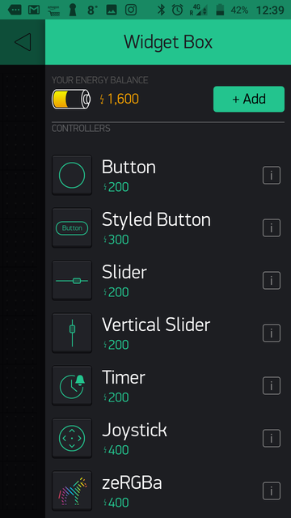
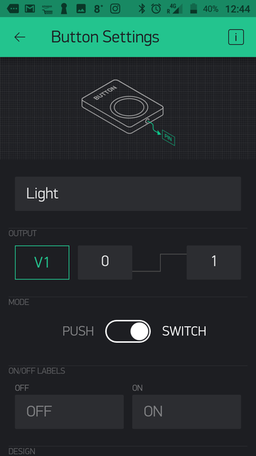
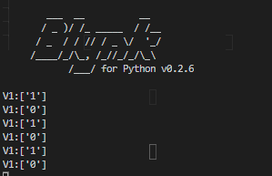
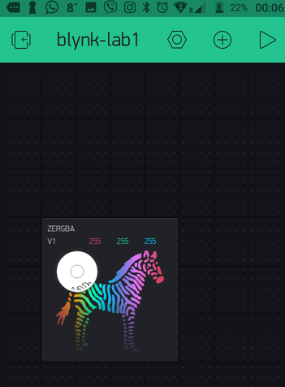
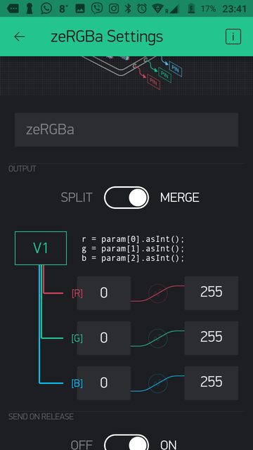
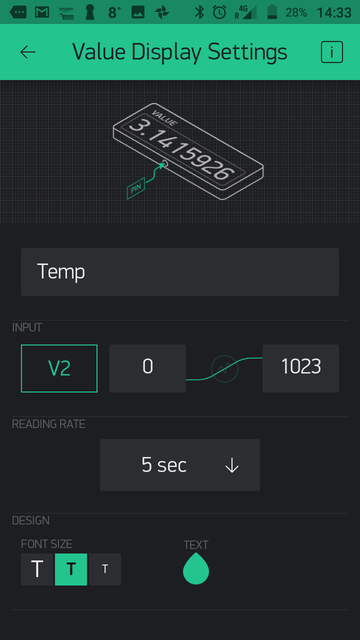

# Send And Receive Data

So now lets send commands from your phone to the Raspberry Pi. Open ``Blynk-lab1`` project in Blynk on your mobile device and do the following:

+ Click on the ``+`` icon in the menu to open the ``Widget box``



+ Select the ``Button`` and it should appear on your project


+ Double tap the button and apply the following settings
    + name it ``Light``
    + In the Output section, select ``PIN`` and change it to ``Virtual V1``
    + Change the Mode to ``Switch``



+ Now hit the back arrow to return to the Project.

+ Click the ``Run`` Button to start the app on the phone.
+ Click on the ``Light`` button a few times, it will toggle between on and off.
+ Examine the output on the RPi console, you should see the following:



You're now controlling the virtual pin from your phone from anywhere via the internet. To confirm this, you can turn off the Wifi on your phone and use the 3G/4G data from your phone network - it should still work.

Next let's hook up the SenseHat to the virtual pin.

+ Stop your Blynk app on the RPi by entering ``ctrl-c`` at the command line.


+ Now replace the code in ``blynk.py`` to the following(remember to replace the BLYNK_AUTH value as before):

```python
import blynklib
from sense_hat import SenseHat

BLYNK_AUTH = 'TOKQooLlURdxxxxohAhxx1tktDJQw'

sense = SenseHat()

#clear sensehat and intialise light_state
sense.clear()

# initialize Blynk
blynk = blynklib.Blynk(BLYNK_AUTH)

# register handler for virtual pin V1 write event
@blynk.handle_event('write V1')
def write_virtual_pin_handler(pin, value):
    print('V1:'+ str(value))
    if value[0]=="1":
        sense.clear(255,255,255)
    else:
        sense.clear()

while True:
    blynk.run()
```

The updated code now includes the following; initialises the SenseHat with ``sense.clear()`` and sets the LEDs to ``white`` when the virtual pin, ``v1``, is set to 1. Every time the button is pressed in the phone app results in the callback function for the ``write`` event to execute. Compare this to how you handled Python callbacks in the MQTT lab.


## Use the ZeRGBa

Lets replace the button with a more interactive way of controlling the LED matrix.

+ Stop the Blynk app on the phone and delete the button by double tapping, scrolling down and selecting the ``Delete`` option.
+ Now, as before, open the ``Widget Box`` and add the ``zeRGBra`` widget. Your app should look like this:



+ Double tab the zeRGBra widget and configure as follows:
  + Set the Output to Merge. This sends all values out on the one pin(as an array)
  + Set pin to Virtual Pin 1 (V1)



+ Now, in ``blynk.py`` on the RPi, replace the ``def write_virtual_pin_handler(...`` function with the following code:

```python
# register handler for virtual pin V1 write event
@blynk.handle_event('write V1')
def write_virtual_pin_handler(pin, value):
    print('V1:'+ str(value))
    r=int(value[0]) # or you could do this: value = list(map(int, value))
    g=int(value[1])
    b=int(value[2])
    sense.clear(r,g,b)
```
The above write callback converts the array of rgb values written by the zeRGBra widget to numeric(integers) and passes the values to the sensehat leds.

+ Start the Blynk service on the RPi by entering ``pyhton3 blynk.py `` at the command prompt. 
+ Run the Blynk Phone app again. You should now be able to set the colour of the LEDs using the zeRGBra!

## Get data from the RPi to your phone 

+ Stop the Node App on the RPi by entering  *ctrl+c* at the command prompt.

+ Stop the app on your phone by clicking on the ``Stop`` icon button in the menu bar.

+ Click on the ``+`` icon in the menu to open the ``Widget box`` and add a ``Value Display`` widget.

+ Double tap on the ``Value Display`` widget and configure the widget to use virtual pin ``V2`` and read the value every 5 seconds as follows:



+ Now, on the Raspberry Pi, in ``blynk.py``, add the following function just under the ``def write_virtual_pin_handler...`` 

```python
# register handler for virtual pin V2(temperature) reading
@blynk.handle_event('read V2')
def read_virtual_pin_handler(pin):
    temp=round(sense.get_temperature(),2)
    print('V2 Read: ' + str(temp))  # print temp to console
    blynk.virtual_write(pin, temp)
```

The updated code "listens" for reads events on virtual pin ``V2``, gets the SenseHAT temperature value, and returns the temperature value to pin ``V2``.

+ Now run the node app on the RPi as before using ``node index.js``.
+ Run the ``Blynk-lab1`` app on your phone again by tapping the ``Run`` icon. It will now read the value of the virtual pin ``V2`` every 5 seconds and display the returned value.

You now have a phone app that can actuate an action(send a command) on the RPi to set LED colour. The Phone app can also retrieve and display sensor data (temperature)!

