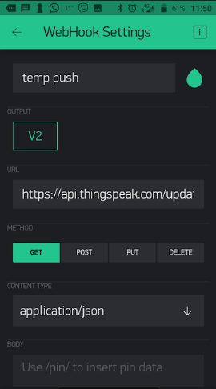
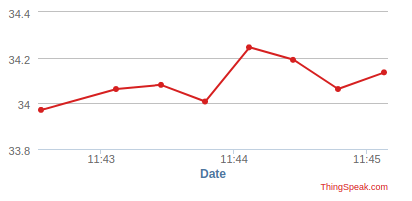

# Sending Data to Thingspeak using Web Hook

The Blynk Webhook widget allows you to communicate with 3rd party services. With Webhook widget you can send HTTP(S) requests to any 3rd party service or devices that has HTTP(S) API (e.g. other smart devices with a Web API, Thingspeak, Smart Lights). 

## Thingspeak Temperature Channel

+ Go to Thingspeak and, if you haven't already, create a channel for Temperature data. You can use one from previous labs if you want. 

+ Retrieve your ``Write API Key`` for the channel you wish to use. 

## Blynk Phone App

+ On your phone, stop the Blynk app if it's running.
+ As in previous steps, open the Widget Box and add the ``Webhook`` widget to your app (you'll need to scroll down to find it).
+ For this part, we will want to monitor virtual pin ``V2`` and send the data to Thingspeak.

+ Double tap the Webhook widget and configure as shown below:



**The URL field should be filled in as follows:**
```
https://api.thingspeak.com/update?api_key=YOUR_API_WRITE_KEY&field1=/pin/
```

Now, every time there is a “write” command to V2 pin on the Raspberry Pi the Webhook will be triggered and write the value (in this case the temp) into the URL using the ``/pin/`` placeholder.
See [here](https://docs.blynk.cc/#widgets-other-webhook) for more details

+ Now run your Phone app and Node app again. You should see temperature data appear in thingspeak (and you didn't even have to write any code!)

